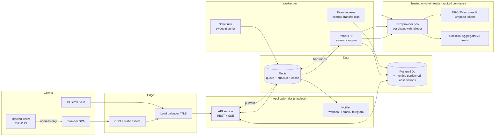
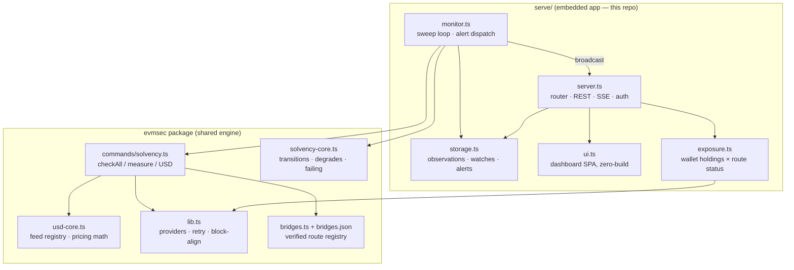
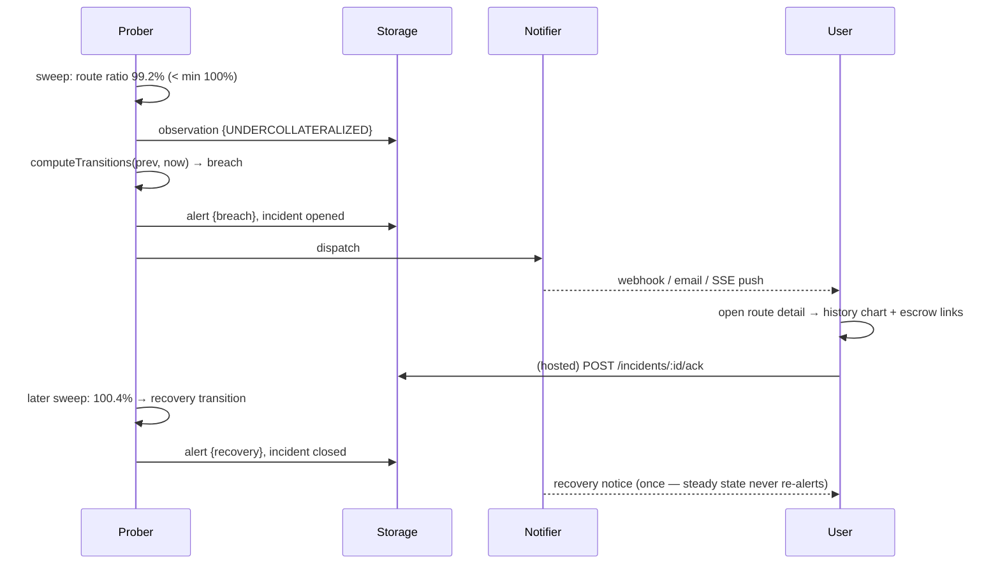

# Watchtower — bridge solvency monitoring, as a product

Watchtower turns evmsec's flagship check — _is this lock-and-mint bridge actually
backed?_ — into an application: a live dashboard, per-user watches, alerting with
an incident lifecycle, history, and a "my exposure" view driven by a connected
wallet. The smart contracts involved (ERC-20 escrows and wrapped tokens, Chainlink
`AggregatorV3` price feeds, Gnosis Safe / timelock admin contracts) are **audited,
trusted external components**; Watchtower only _reads_ them through their
documented interfaces. No contract is deployed or mutated by this application.

Two deployment shapes share one engine:

- **Embedded** (`evmsec serve`) — a single process bundled with the CLI: API +
  dashboard + monitor + file-backed storage. Zero external services. This is what
  ships in this repo, today. _(Implemented — see `src/serve/`.)_
- **Hosted** (multi-tenant SaaS) — the same engine behind a real database, queue,
  and account system. This document specifies it fully; the roadmap (§12)
  sequences the build.

---

## 1. System architecture



Principles:

- **The database is the source of truth**; the chain is the source of _facts_.
  Every sweep writes immutable `observations`; verdicts and incidents are derived
  and re-derivable.
- **Stateless app tier** — sessions are cookie-carried (signed), SSE fan-out goes
  through Redis pub/sub so any API instance can serve any stream.
- **Workers are idempotent** — a sweep re-run writes the same observation row
  (PK `route_id, at-block`), so at-least-once delivery from the queue is safe.
- The embedded build collapses this to one process: monitor loop in-process,
  JSONL files instead of Postgres, direct in-memory SSE fan-out. Same engine,
  same pure cores (`solvency-core`, `usd-core`), same tests.

## 2. Component diagram



Boundaries: `storage`, `monitor`, and `server` know each other only through
constructor-injected interfaces (the repo's established DI-for-testing pattern),
so each is unit-tested without network or disk where possible.

## 3. Database schema (hosted / PostgreSQL)

The embedded build persists the same shapes as JSONL under `--data-dir`
(`observations/<route>.jsonl`, `alerts.jsonl`, `watches.json`). The hosted DDL:

```sql
create extension if not exists citext;

create table users (
  id          uuid primary key default gen_random_uuid(),
  email       citext unique,                -- nullable: wallet-only accounts
  created_at  timestamptz not null default now()
);

create table wallets (                       -- SIWE-verified addresses
  address     char(42) primary key,          -- EIP-55
  user_id     uuid not null references users(id) on delete cascade,
  verified_at timestamptz not null default now()
);

create table siwe_nonces (
  nonce       text primary key,
  address     char(42) not null,
  expires_at  timestamptz not null,
  used_at     timestamptz
);

create table sessions (
  id          uuid primary key default gen_random_uuid(),
  user_id     uuid not null references users(id) on delete cascade,
  token_hash  bytea not null unique,         -- sha-256 of opaque cookie token
  expires_at  timestamptz not null,
  created_at  timestamptz not null default now()
);

create table api_keys (
  id          uuid primary key default gen_random_uuid(),
  user_id     uuid not null references users(id) on delete cascade,
  name        text not null,
  key_hash    bytea not null unique,
  scopes      text[] not null default '{read}',
  last_used_at timestamptz
);

create table routes (                        -- registry + user-submitted
  id          text primary key,              -- "polygon-pos-usdc"
  bridge      text not null,
  asset       text not null,
  lock_legs   jsonb not null,                -- [{chain,escrow,token}, ...]
  mint        jsonb not null,                -- {chain, token}
  source_url  text,                          -- citation (registry discipline)
  verified    boolean not null default false,-- read BACKED live before listing
  created_by  uuid references users(id)      -- null = bundled registry
);

create table watches (
  id            uuid primary key default gen_random_uuid(),
  user_id       uuid not null references users(id) on delete cascade,
  route_id      text not null references routes(id) on delete cascade,
  min_ratio_pct numeric(7,4) not null default 100,
  enabled       boolean not null default true,
  created_at    timestamptz not null default now(),
  unique (user_id, route_id)
);

-- Immutable sweep results. Partitioned by month; consider TimescaleDB.
create table observations (
  route_id    text not null references routes(id),
  at          timestamptz not null,
  mint_block  bigint,
  locked_18   numeric(78,0),                 -- 18-dp fixed point, exact
  minted_18   numeric(78,0),
  ratio_pct   numeric(10,4),
  locked_usd  numeric(20,2),
  price_usd   numeric(20,8),
  priced_via  text,                          -- "BTC/USD", "cbETH/ETH × ETH/USD"
  verdict     text not null check (verdict in
                ('BACKED','UNDERCOLLATERALIZED','NO_SUPPLY','ERROR')),
  error       text,
  primary key (route_id, at)
) partition by range (at);

create table incidents (                     -- derived from transitions
  id          uuid primary key default gen_random_uuid(),
  route_id    text not null references routes(id),
  kind        text not null check (kind in ('breach','degrade','error')),
  opened_at   timestamptz not null,
  closed_at   timestamptz,                   -- null = ongoing
  opening_ratio numeric(10,4),
  acked_by    uuid references users(id),
  acked_at    timestamptz
);
create index on incidents (route_id, opened_at desc);

create table alert_channels (
  id          uuid primary key default gen_random_uuid(),
  user_id     uuid not null references users(id) on delete cascade,
  kind        text not null check (kind in ('webhook','email','telegram')),
  config      jsonb not null,                -- {url} | {email} | {chat_id}
  verified_at timestamptz                    -- challenge-verified before use
);

create table deliveries (                    -- notification audit trail
  id          uuid primary key default gen_random_uuid(),
  incident_id uuid not null references incidents(id) on delete cascade,
  channel_id  uuid not null references alert_channels(id) on delete cascade,
  status      text not null check (status in ('pending','sent','failed')),
  attempts    int not null default 0,
  last_error  text,
  delivered_at timestamptz
);
```

Retention: raw `observations` kept 13 months, then rolled up to daily min/avg;
`incidents` and `deliveries` kept indefinitely (they are the audit trail).

## 4. API specification

REST + SSE, JSON everywhere, versioned under `/api`. Auth: session cookie (SIWE
login) or `Authorization: Bearer <api-key>`; the embedded build uses a single
bearer token (`--token` / `EVMSEC_TOKEN`) for writes and binds to loopback by
default. Public reads are unauthenticated in embedded mode.

| Method | Path                        | Auth  | Purpose                                                  |
| ------ | --------------------------- | ----- | -------------------------------------------------------- |
| GET    | `/api/health`               | —     | liveness: `{ok, uptimeSec, lastSweepAt}`                 |
| GET    | `/api/status`               | read  | latest snapshot: rollup + one row per route (incl. USD)  |
| GET    | `/api/routes`               | read  | registry + user routes (definition, source, verified)    |
| GET    | `/api/routes/:id/history`   | read  | recent observations (`?limit=`, newest first)            |
| GET    | `/api/alerts`               | read  | recent breach/recovery/error events (`?limit=`)          |
| GET    | `/api/exposure?address=0x…` | read  | caller's wrapped-token balances × route status × USD     |
| GET    | `/api/stream`               | read  | SSE: `status` after each sweep, `alert` on transitions   |
| POST   | `/api/watches`              | write | add a custom route to the sweep (validated, checksummed) |
| GET    | `/api/watches`              | read  | list custom watches                                      |
| DELETE | `/api/watches/:id`          | write | remove a custom watch                                    |
| POST   | `/api/auth/nonce`           | —     | _(hosted)_ issue SIWE nonce for an address               |
| POST   | `/api/auth/verify`          | —     | _(hosted)_ verify EIP-4361 signature → session cookie    |
| POST   | `/api/incidents/:id/ack`    | write | _(hosted)_ acknowledge an incident                       |

`GET /api/status` response shape (embedded and hosted are identical):

```json
{
  "generatedAt": "2026-07-01T20:31:04.118Z",
  "overall": "backed",
  "backed": 11,
  "breached": 0,
  "errored": 0,
  "total": 11,
  "totalLockedUsd": 2497497515,
  "routes": [
    {
      "id": "arbitrum-wbtc-gateway",
      "bridge": "Arbitrum (canonical bridge)",
      "asset": "WBTC",
      "lockChain": "Ethereum",
      "mintChain": "Arbitrum One",
      "locked": "7214.381581",
      "minted": "7205.336158",
      "ratioPct": 100.1255,
      "verdict": "BACKED",
      "lockedUsd": 422554063,
      "pricedVia": "BTC/USD",
      "at": "2026-07-01T20:31:04.118Z"
    }
  ]
}
```

SSE contract: event `status` carries the same snapshot; event `alert` carries
`{kind: "breach"|"recovery", at, ...route}` — exactly the shape `solvency
--watch --webhook` already POSTs, so webhook consumers and stream consumers
share one schema. Errors are `{error: string}` with conventional status codes
(400 validation, 401 missing/bad token, 404 unknown id, 405 method).

## 5. Frontend pages

Embedded UI is a zero-build SPA (hash-routed, served by the API itself); the
hosted frontend is the same IA in Next.js + TanStack Query. Pages:

| Route                | Page             | Contents                                                                                                                                                                                                                        |
| -------------------- | ---------------- | ------------------------------------------------------------------------------------------------------------------------------------------------------------------------------------------------------------------------------- |
| `#/`                 | **Status board** | overall pill (backed / breached / degraded), tracked TVL, last-sweep time; table: verdict, bridge, asset, route, backing %, USD value, sparkline of recent ratio; live via SSE                                                  |
| `#/route/<id>`       | **Route detail** | definition (escrow/token/chains with explorer links, source citation), large history chart, recent observations table, incident history                                                                                         |
| `#/alerts`           | **Alerts**       | reverse-chron feed of breach/recovery/error transitions with ratios at transition time                                                                                                                                          |
| `#/watches`          | **Watches**      | list custom routes; add form (lock chain/escrow/token → mint chain/token, min-ratio); delete; write-token prompt when configured                                                                                                |
| `#/exposure`         | **My exposure**  | connect wallet (EIP-1193, address only — no signatures, no tx) or paste an address; per-route wrapped-token balance, USD value, and the route's current verdict — "how much of _my_ money sits on bridges, and are they backed" |
| _(hosted)_ `/signin` | **Sign in**      | SIWE: connect → nonce → sign EIP-4361 message → session; optional email link for notifications                                                                                                                                  |

Design language: dark, dense, monospace numerals; verdict colors match the CLI
(✓ green / 🔴 red / ⚠ amber); every address is an explorer link; every number
carries its provenance (feed pair, block time).

## 6. Backend services

| Service   | Embedded form            | Hosted form                             | Responsibility                                                                                                                                       |
| --------- | ------------------------ | --------------------------------------- | ---------------------------------------------------------------------------------------------------------------------------------------------------- |
| API       | `serve/server.ts`        | N stateless replicas                    | REST + SSE, auth, validation, static UI                                                                                                              |
| Scheduler | `setInterval` in-process | leader-elected cron                     | plan a sweep every `--interval` (default 60 s)                                                                                                       |
| Prober    | `monitor.ts` sweep       | queue consumers ×N                      | run `checkAll(routes)` — block-timestamp-aligned reads, per-route error isolation, USD pricing                                                       |
| Notifier  | inline webhook POST      | queue consumer w/ retry + backoff + DLQ | deliver alerts to channels; record `deliveries`                                                                                                      |
| Indexer   | _(not embedded)_         | per-chain log follower                  | escrow/minted-token `Transfer` events for incident forensics (the `--since` bisect, precomputed); reorg-safe: track block hashes, rewind on mismatch |

Transition semantics are shared with the CLI via `solvency-core.ts`
(`computeTransitions`: alert once per breach _transition_, recover quietly,
first sighting of an already-broken route counts as a breach) — the dashboard,
the CLI `--watch`, and the hosted notifier cannot drift apart because they call
the same pure function.

## 7. Smart contract interaction layer

All chain access is **read-only** against audited, documented interfaces:

| Contract                                         | Interface used                          | Calls                                              |
| ------------------------------------------------ | --------------------------------------- | -------------------------------------------------- |
| ERC-20 (escrowed collateral, wrapped supply)     | ERC-20 standard                         | `balanceOf(escrow)`, `totalSupply()`, `decimals()` |
| Chainlink price feeds                            | `AggregatorV3Interface`                 | `latestRoundData()`, `decimals()`                  |
| Safe / timelock admin contracts _(audit checks)_ | `getThreshold/getOwners`, `getMinDelay` | classification only                                |

Guarantees the layer provides (all implemented in `lib.ts` / `commands/solvency.ts`):

- **Point-in-time consistency**: the destination chain's head block sets a
  timestamp; each lock chain is read at its last block at-or-before that
  timestamp (`blockAtOrBefore`) so multi-chain legs describe one moment.
- **Exactness where it matters**: balances are summed in 18-dp fixed-point
  `bigint`; floats appear only in display/USD layers.
- **Resilience**: bounded retries with exponential backoff on transient RPC
  errors (`withRetry`), bounded sweep concurrency (`mapWithConcurrency`),
  per-route error isolation (one dead RPC → one `ERROR` row, not a dead sweep).
- **Price integrity**: Chainlink answers ≤ 0 are rejected (`priceFromHops`
  returns null — never a silent $0 valuation); a price failure never masks the
  backing verdict; stablecoins are priced off their real feeds so a depeg
  surfaces. Every feed address was verified live before being pinned.
- **Provider strategy** (hosted): a pool per chain — paid primary, public
  fallback — rotated on failure; per-provider rate budgets; archive nodes only
  for the forensic bisect path.

## 8. State management

- **Server**: storage is the single source of truth; the monitor holds only the
  previous failing-state map (for transition de-dup) and rebuilds it from the
  last observations on boot — restarts do not re-alert steady-state breaches.
- **Client (embedded SPA)**: one in-memory store `{status, alerts, watches}`
  hydrated by fetch, updated by SSE events; views re-render from the store; the
  EventSource auto-reconnects and re-hydrates on `open` so a dropped stream
  can't leave a stale board. Write flows (watch add/delete) are pessimistic:
  server confirms, then the store updates — a monitoring tool must not show
  optimistic fiction.
- **Client (hosted)**: TanStack Query with SSE-driven invalidation; wallet state
  via wagmi; session via httpOnly cookie, never readable by JS.

## 9. User flows

**Breach → page → recover** (the flow the product exists for):



**Sign-in (hosted, SIWE)**: connect wallet → `POST /api/auth/nonce` →
wallet signs the EIP-4361 message (domain, address, nonce, expiry) →
`POST /api/auth/verify` → server recovers the signer, checks nonce
freshness/single-use, sets httpOnly session cookie. No password, no custody.

**Create a watch**: form (chains, escrow, token, minted token, min-ratio) →
server validates checksums + known chains → route enters the next sweep →
first observation appears on the board within one interval.

**Exposure check**: connect wallet (address only) or paste address →
`GET /api/exposure` → server reads `balanceOf(address)` on each mint chain →
table of holdings × current verdict × USD. Read-only; nothing is signed.

## 10. Deployment plan

**Embedded** (ships now): `npx evmsec serve --port 8787` — binds `127.0.0.1`
by default; `--host 0.0.0.0` for LAN/container exposure (writes then require
`--token`). State in `--data-dir` (default `.evmsec-serve/`). Docker: the
existing image runs it (`docker run -p 8787:8787 -v data:/data ghcr.io/0xsoftboi/evmsec
serve --host 0.0.0.0 --data-dir /data`).

**Hosted**:

- Containers from the existing multi-stage `Dockerfile`; API and workers are the
  same image with different entrypoints.
- Environments: `staging` → `production`, promoted by image digest.
- Postgres (managed, PITR backups), Redis (managed). Migrations run as a
  pre-deploy job (`migrate deploy`); app boots refuse a schema-version mismatch.
- Rollout: blue-green behind the LB; SSE clients reconnect on drain (the client
  already re-hydrates on reconnect).
- Secrets: RPC URLs, `ETHERSCAN_API_KEY`, SMTP/Telegram creds via the platform
  secret store — never in the image (the config layer already treats empty env
  as absent).
- **CI/CD** (extends the repo's existing Actions): PR → `npm run check` (format,
  lint, typecheck, registry validation, tests) on Node 20/22 → build image →
  staging deploy → smoke (`/api/health`, one live sweep against a pinned
  fixture route) → manual gate → production. Release tags publish to npm + GHCR
  with provenance (already wired in `release.yml`).
- **Monitoring the monitor**: `/api/health` behind an external uptime check;
  metrics (sweep duration, per-chain RPC error rate, queue depth, alert
  end-to-end latency, SSE client count) exported Prometheus-style; error
  tracking (Sentry); an alert on _missed sweeps_ — silence is the failure mode
  a monitoring product cannot have. The GitHub-Actions status page
  (`bridge-status.yml`) stays on as an independent, out-of-band heartbeat.

## 11. Testing strategy

Layered, following the repo's proven pattern (pure cores + DI + record/replay):

1. **Pure units** (no I/O): transition/degrade math (`solvency-core.test.ts`),
   pricing math (`usd-core.test.ts`), storage ring/compaction, router matching.
2. **Component with injected fakes**: `monitor` with a fake checker — breach →
   alert recorded + webhook body correct + second sweep does _not_ re-alert;
   `server` endpoints via real HTTP against port 0 with a stubbed store —
   status/history/alerts shapes, watch CRUD, 401 on missing token, 404/400/405.
3. **Chain-read regression**: the existing record/replay harness
   (`incident-fixtures`) pins engine verdicts against captured mainnet reads,
   offline — a drifting heuristic fails CI.
4. **E2E (hosted)**: Playwright — sign-in with a test wallet, create watch, see
   SSE update, receive webhook (captured by a test sink).
5. **Load**: k6 on `/api/status` (cheap, cached) and SSE fan-out (thousands of
   idle streams); sweep soak test with N=500 routes against a mock RPC.
6. **Failure injection**: mock RPC that times out / returns garbage — assert
   ERROR isolation, retry counts, and that alerts still fire for healthy routes.

## 12. Production roadmap

| Phase                         | Scope                                                                                                                                    | Exit criteria                                                                        |
| ----------------------------- | ---------------------------------------------------------------------------------------------------------------------------------------- | ------------------------------------------------------------------------------------ |
| **v0 — embedded** _(this PR)_ | `evmsec serve`: board, detail, alerts, watches, exposure, SSE, webhook, token auth, JSONL storage                                        | `npm run check` green; boots and monitors the 11-route registry out of the box       |
| **v1 — hosted read-only**     | deploy embedded engine behind Postgres storage driver; public status board; uptime + metrics                                             | 99.9% board availability; sweep p95 < interval                                       |
| **v2 — accounts & alerting**  | SIWE auth, watches per user, email/telegram channels with challenge verification, incident ack, API keys                                 | alert end-to-end p95 < 90 s from breached sweep                                      |
| **v3 — depth**                | event indexer (escrow flows precomputed), forensic bisect UI, daily rollups, route submission + review queue with live verification gate | incident forensics load < 2 s; community routes onboarded with the verify-first gate |
| **v4 — scale & SLA**          | provider pools per chain, sweep sharding, Redis SSE fan-out, rate-limited public API, status SLA                                         | 1 000+ routes, 30 s intervals, multi-region                                          |

---

_Scope note: Watchtower is an integration and monitoring application. It treats
all smart contracts as audited and trusted, interacts with them strictly through
their public read interfaces, and its verdicts are operational heuristics over
on-chain state — documentation for defenders, not an attack surface._
